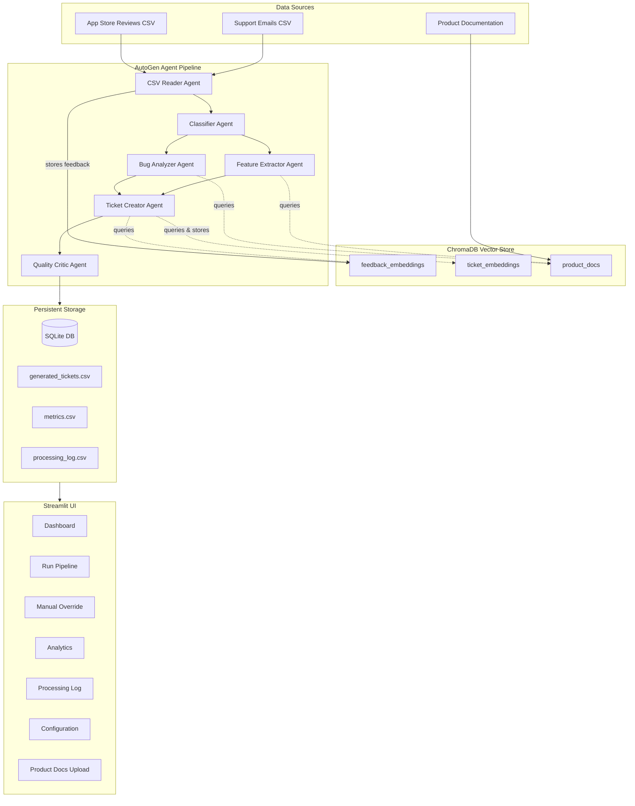
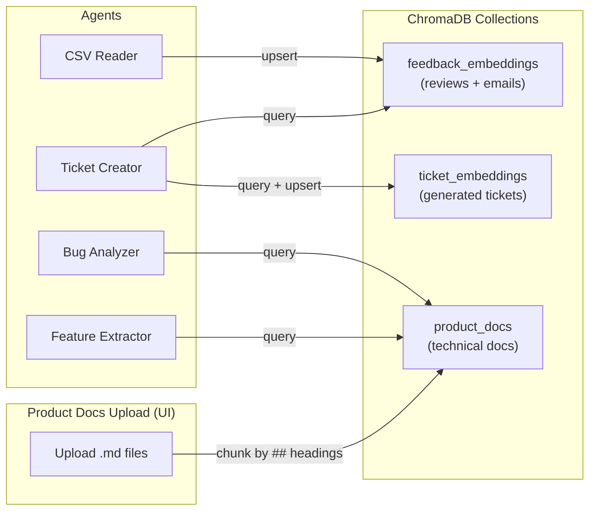
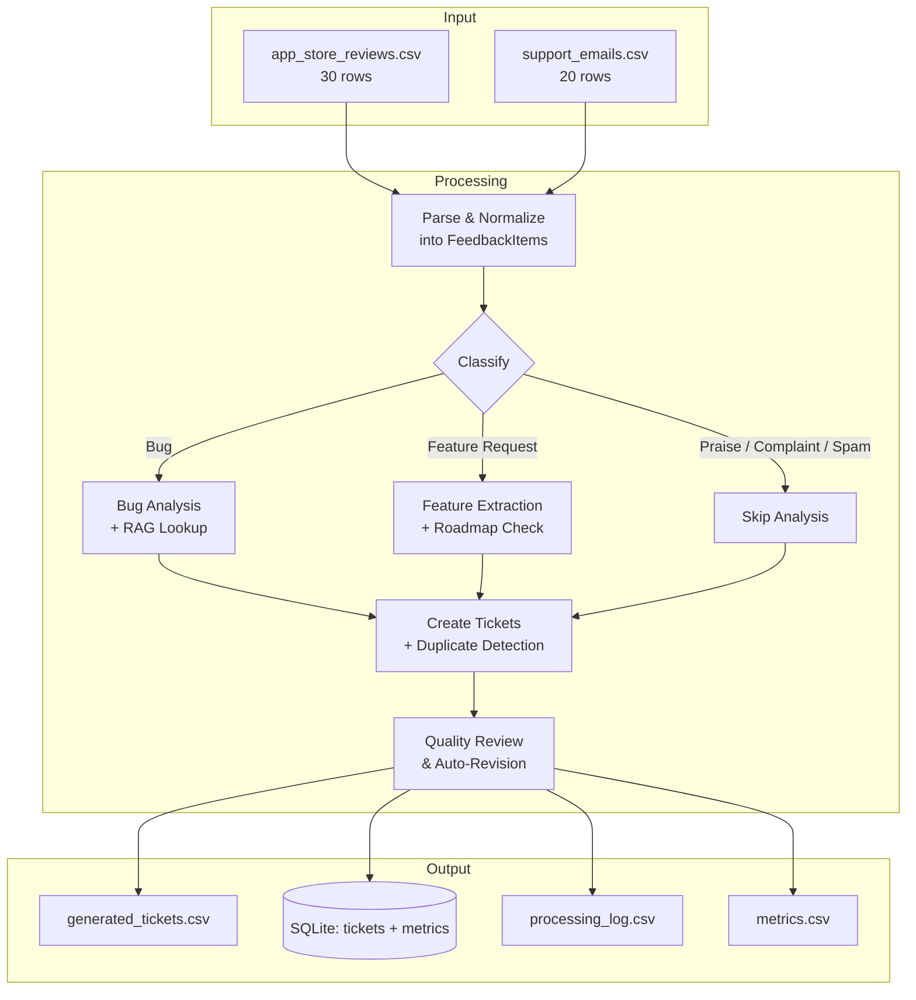

# SignalDesk Feedback Intelligence Hub

An AI-powered multi-agent system that automatically processes user feedback from app store reviews and support emails, classifies them, extracts actionable insights, and generates structured support tickets, all with RAG-enhanced context from product documentation.

## Features

- **Automated Feedback Classification** - Classifies feedback into Bug, Feature Request, Praise, Complaint, or Spam with confidence scores
- **RAG-Enhanced Bug Analysis** - Matches reported bugs against known issues using product documentation stored in ChromaDB
- **RAG-Enhanced Feature Extraction** - Cross-references feature requests with the product roadmap to identify already-planned features
- **Duplicate Detection** - Uses vector similarity search across feedback and ticket embeddings to flag duplicates
- **Quality Assurance** - Auto-reviews and revises low-quality tickets (score < 0.7)
- **Interactive Dashboard** - Real-time metrics, charts, and ticket management via Streamlit
- **Product Docs Upload** - Upload technical documentation to enrich RAG context for agents
- **Configurable Pipeline** - Adjust model, thresholds, and priority mappings from the UI

## Technology Stack

| Component | Technology | Purpose |
|---|---|---|
| LLM Engine | OpenAI GPT-4o-mini | Feedback reasoning and extraction |
| Agent Framework | AutoGen | Multi-agent coordination and state flow |
| Knowledge Store | ChromaDB | Vector embeddings for RAG (feedback, tickets, product docs) |
| Data Layer | SQLite + SQLAlchemy | Persistent ticket and metrics storage |
| UI Layer | Streamlit | Real-time dashboard and operations interface |
| Deployment | Docker Compose | Container orchestration for reproducibility |
| Runtime | Python 3.14 | Core implementation language |

## Architecture

### System Overview



### Agent Pipeline Flow

```mermaid
flowchart LR
    START((Start)) --> CSVReader

    subgraph Ingestion
        CSVReader[CSV Reader\nAgent]
    end

    subgraph Classification
        Classifier[Classifier\nAgent]
    end

    subgraph Analysis
        BugAnalyzer[Bug Analyzer\nAgent]
        FeatureExtractor[Feature Extractor\nAgent]
    end

    subgraph TicketGen["Ticket Generation"]
        TicketCreator[Ticket Creator\nAgent]
        QualityCritic[Quality Critic\nAgent]
    end

    CSVReader --> Classifier
    Classifier --> BugAnalyzer
    BugAnalyzer --> FeatureExtractor
    FeatureExtractor --> TicketCreator
    TicketCreator --> QualityCritic
    QualityCritic --> SaveOutputs[Save Outputs]
    SaveOutputs --> DONE((End))

    style CSVReader fill:#4CAF50,color:#fff
    style Classifier fill:#2196F3,color:#fff
    style BugAnalyzer fill:#FF9800,color:#fff
    style FeatureExtractor fill:#FF9800,color:#fff
    style TicketCreator fill:#9C27B0,color:#fff
    style QualityCritic fill:#F44336,color:#fff
```



### RAG Architecture



### Data Flow



## Project Structure

```
FeedbackAnalysisApp/
|-- agents/                    # AutoGen-backed agent modules
|   |-- bug_analyzer.py        # Bug analysis with product docs RAG
|   |-- classifier.py          # Feedback classification (5 categories)
|   |-- csv_reader.py          # CSV ingestion + RAG storage
|   |-- feature_extractor.py   # Feature extraction with roadmap RAG
|   |-- heuristics.py          # Deterministic fallback logic for offline/demo runs
|   |-- llm.py                 # Shared AutoGen/OpenAI helper + JSON parsing
|   |-- pipeline.py            # AutoGen orchestration + output saving
|   |-- quality_critic.py      # Ticket quality review + auto-revision
|   |-- state.py               # PipelineState & FeedbackItem TypedDicts
|   `-- ticket_creator.py      # Ticket creation + duplicate detection
|-- config/                    # Configuration & infrastructure
|   |-- database.py            # SQLAlchemy models (Ticket, Metric, ProcessingLog)
|   |-- logger.py              # Structured logging to CSV + console
|   |-- settings.py            # Central config from .env
|   `-- vectorstore.py         # ChromaDB setup (3 collections) + helpers
|-- data/                      # Input data & outputs
|   |-- app_store_reviews.csv  # Mock app reviews (30 rows)
|   |-- support_emails.csv     # Mock support emails (20 rows)
|   |-- expected_classifications.csv  # Ground truth labels
|   `-- product_docs/          # Technical docs for RAG
|       |-- architecture.md
|       |-- features.md
|       |-- known_bugs.md
|       `-- roadmap.md
|-- ui/                        # Streamlit frontend
|   |-- app.py                 # Main app with sidebar navigation
|   `-- pages/
|       |-- dashboard.py       # Overview metrics & ticket table
|       |-- run_pipeline.py    # CSV upload & pipeline execution
|       |-- configuration.py   # Settings panel (model, thresholds)
|       |-- manual_override.py # Inline ticket editing
|       |-- analytics.py       # Charts & statistics
|       |-- processing_log.py  # Filterable log viewer
|       `-- product_docs.py    # Upload & manage RAG documents
|-- tests/                     # Test suite (pytest)
|-- logs/                      # Human-readable runtime flow logs
|   `-- pipeline_flow.log
|-- reports/                   # Per-run summary reports for beginners
|   |-- latest_run_report.md
|   `-- latest_run_report.json
|-- deployment/
|   |-- linux-local/
|   |   `-- run_demo.sh
|   |-- windows-local/
|   |   `-- run_demo.ps1
|   |-- docker/
|   |   |-- Dockerfile
|   |   |-- docker-compose.yml
|   |   |-- deploy.sh
|   |   `-- terminate.sh
|   |-- azure/
|   |   |-- deploy.sh
|   |   `-- terminate.sh
|   `-- aws/
|       |-- deploy.sh
|       `-- terminate.sh
|-- requirements.txt
`-- .env                       # Environment configuration
```

## Learning-Friendly Observability

To understand flow quickly after each run:

- Read `logs/pipeline_flow.log` for stage-by-stage runtime narration.
- Read `reports/latest_run_report.md` for a plain-English run summary.
- Read `reports/latest_run_report.json` for machine-readable run details.
- Open the **Flow Explorer** page in Streamlit to view logs/reports in-app.

## Quick Start

## Guides

- Requirements traceability: `docs/REQUIREMENTS_TRACEABILITY.md`
- User guide (deploy, run, interpret results): `docs/USER_GUIDE.md`
- Developer guide (architecture, components, setup, stack): `docs/DEVELOPER_GUIDE.md`
- Deployment scripts index (all environments): `deployment/README.md`
- Demo runbook (prereqs + step-by-step execution): `docs/DEMO_RUNBOOK.md`
- Demo presentation script (5-7 min talk track): `docs/DEMO_PRESENTATION_SCRIPT.md`

## One-Click Demo

From the `FeedbackAnalysisApp/` folder:

```powershell
.\deployment\windows-local\run_demo.ps1
```

Options:

```powershell
# Skip pipeline and only start UI
.\deployment\windows-local\run_demo.ps1 -SkipPipeline

# Run on a custom port
.\deployment\windows-local\run_demo.ps1 -Port 8502
```

### Prerequisites

- Docker & Docker Compose
- OpenAI API key for model-backed runs

If no API key is configured, the application still runs using deterministic fallback logic for demo and testing flows.

### Run with Docker

```bash
# Set your OpenAI API key in .env
echo "OPENAI_API_KEY=sk-your-key-here" >> .env

# Build and start
docker compose -f deployment/docker/docker-compose.yml up --build -d

# Open in browser
open http://localhost:8501
```

### Run Locally

```bash
# Create virtual environment
python -m venv venv
source venv/bin/activate

# Install dependencies
pip install -r requirements.txt

# Set your OpenAI API key
export OPENAI_API_KEY=sk-your-key-here

# Run the Streamlit app
streamlit run ui/app.py
```

## Usage

1. **Run Pipeline** - Upload CSV files or use the included mock data, then click "Run Analysis Pipeline"
2. **Dashboard** - View processed feedback metrics, category/priority charts, and generated tickets
3. **Manual Override** - Edit ticket fields (title, category, priority, description) inline
4. **Analytics** - Explore quality scores, confidence distributions, and processing trends
5. **Product Docs** - Upload technical documentation (.md files) to improve RAG context
6. **Configuration** - Adjust model, confidence thresholds, and priority mappings

## Agent Details

| Agent | Role | RAG Usage |
|---|---|---|
| **CSV Reader** | Parses reviews + emails into unified schema | Stores all feedback in `feedback_embeddings` |
| **Classifier** | Categorizes into Bug / Feature / Praise / Complaint / Spam | - |
| **Bug Analyzer** | Extracts severity, component, steps to reproduce | Queries `product_docs` for known bugs & root causes |
| **Feature Extractor** | Extracts impact score, user segment, planned status | Queries `product_docs` for roadmap & existing features |
| **Ticket Creator** | Generates structured tickets with duplicate detection | Queries `feedback_embeddings` + `ticket_embeddings` |
| **Quality Critic** | Scores ticket quality (0-1), auto-revises if < 0.7 | - |

## Configuration

Key settings in `.env`:

| Variable | Default | Description |
|---|---|---|
| `OPENAI_API_KEY` | - | OpenAI API key (required) |
| `LLM_MODEL_NAME` | `gpt-4o-mini` | Model for all agents |
| `CLASSIFICATION_CONFIDENCE_THRESHOLD` | `0.7` | Min confidence for auto-classification |
| `CRITICAL_RATING_THRESHOLD` | `1` | Rating threshold for Critical priority |
| `HIGH_RATING_THRESHOLD` | `2` | Rating threshold for High priority |
| `MEDIUM_RATING_THRESHOLD` | `3` | Rating threshold for Medium priority |

